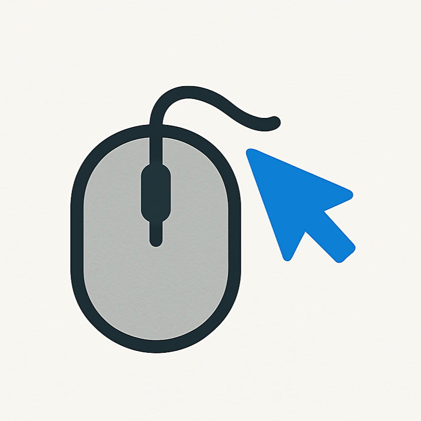

  

  
  
  
  

# LiteMouse - Advanced Mouse Gesture Extension

一个功能强大、简洁高效的Chrome鼠标手势扩展，支持多种手势操作和完全自定义配置。

## ✨ 特性

### 🖱️ 丰富的手势支持
- **左滑手势** - 页面后退
- **右滑手势** - 页面前进
- **L型手势** - 关闭当前标签页
- **上滑手势** - 滚动到页面顶部
- **下滑手势** - 滚动到页面底部
- **圆形手势** - 刷新页面
- **Z字手势** - 重新打开已关闭的标签页

### 🎨 视觉反馈
- 实时手势路径显示
- 页面中央半透明提示信息
- 可自定义路径颜色和线条粗细
- 优雅的动画效果和过渡

### ⚙️ 完全自定义
- 独立控制每个手势的启用/禁用
- 可调节手势识别灵敏度
- 自定义视觉反馈样式
- 链接操作行为配置

### 📊 智能统计
- 手势使用次数统计
- 扩展状态实时显示
- 使用习惯分析

## 🚀 安装

### 开发者模式安装
1. 下载或克隆此项目
2. 打开Chrome浏览器，进入 `chrome://extensions/`
3. 开启右上角的"开发者模式"
4. 点击"加载已解压的扩展程序"
5. 选择项目文件夹

## 📖 使用方法

### 基本操作
1. **激活手势**：按住鼠标右键并拖动
2. **查看状态**：点击扩展图标查看当前状态
3. **快捷切换**：使用 `Ctrl+Shift+M` 快速启用/禁用扩展

### 手势说明
| 手势 | 操作 | 描述 |
|------|------|------|
| ← | 后退 | 向左滑动返回上一页 |
| → | 前进 | 向右滑动前往下一页 |
| ↓→ | 关闭标签 | L型手势关闭当前标签页 |
| ↑ | 回到顶部 | 向上滑动滚动到页面顶部 |
| ↓ | 回到底部 | 向下滑动滚动到页面底部 |
| ○ | 刷新页面 | 画圆形手势刷新当前页面 |
| Z | 恢复标签 | Z字形手势重新打开关闭的标签 |

### 链接操作
- **拖拽链接**：拖拽链接到空白区域在新标签页打开
- **Ctrl+点击**：配合Ctrl键点击链接在新标签页打开

## ⚙️ 设置配置

点击扩展图标 → 设置，可以配置：

### 手势控制
- 启用/禁用特定手势
- 调整手势识别灵敏度（1-10级）

### 视觉效果
- 手势路径颜色选择
- 路径线条粗细调整（1-10px）
- 启用/禁用视觉反馈

### 链接操作
- 拖拽链接行为设置
- Ctrl+点击行为配置

## 🛠️ 开发

### 项目结构
\`\`\`
LiteMouse/
├── manifest.json          # 扩展清单文件
├── content.js             # 内容脚本（手势识别）
├── background.js          # 后台脚本（操作执行）
├── popup.html            # 弹出页面
├── popup.js              # 弹出页面脚本
├── options.html          # 设置页面
├── options.js            # 设置页面脚本
├── styles.css            # 样式文件
├── logo.png              # 扩展图标
└── README.md             # 说明文档
\`\`\`

### 技术栈
- **Manifest V3** - Chrome扩展最新标准
- **Vanilla JavaScript** - 原生JS，无依赖
- **Chrome APIs** - tabs, storage, commands等
- **Canvas API** - 手势路径绘制

### 本地开发
1. 克隆项目：`git clone [repository-url]`
2. 在Chrome中加载扩展（开发者模式）
3. 修改代码后点击"重新加载"按钮

### 性能优化
- 使用 `requestAnimationFrame` 优化canvas绘制
- 路径点数量限制防止内存泄漏
- 智能节流减少不必要的计算
- 缓存机制提升响应速度

## 🔧 故障排除

### 常见问题
1. **手势不响应**
   - 检查扩展是否启用
   - 确认手势功能未被禁用
   - 尝试调整灵敏度设置

2. **路径不显示**
   - 检查视觉反馈是否开启
   - 确认页面没有阻止canvas绘制
   - 尝试刷新页面

3. **与其他扩展冲突**
   - 临时禁用其他鼠标相关扩展
   - 检查快捷键是否冲突

### 调试模式
1. 打开开发者工具（F12）
2. 查看Console面板的调试信息
3. 检查扩展页面的错误日志

---

**享受更高效的浏览体验！** 🚀